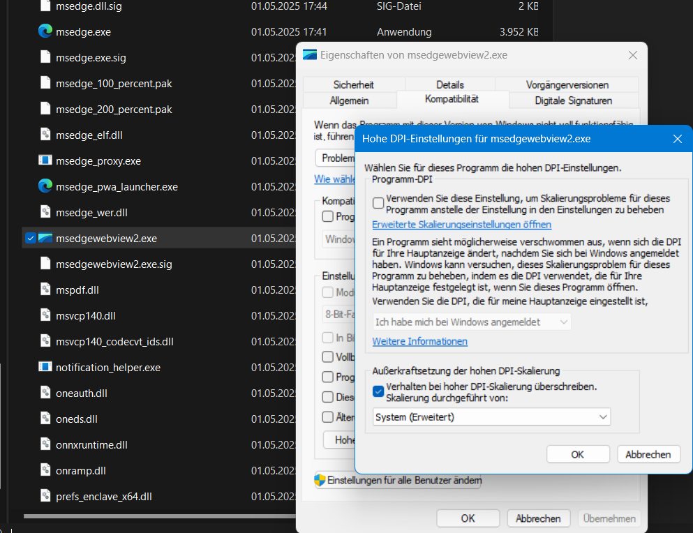

<!-- omit in toc -->
# Eclipse RCP Plugin Sidebar
This is a guide on how to create an Eclipse RCP Plugin that displays any web application in the sidebar of the HCL Notes Client. 

- [Prerequisites](#prerequisites)
- [Eclipse Setup](#eclipse-setup)
  - [Eclipse Prerequisites/ Settings](#eclipse-prerequisites-settings)
    - [(1) Ensure `Compiler compliance level` is set to `Java 17` as this is what `Domino 14` supports.](#1-ensure-compiler-compliance-level-is-set-to-java-17-as-this-is-what-domino-14-supports)
    - [(2) Add the following `JRE System Library` to the build path of your project:](#2-add-the-following-jre-system-library-to-the-build-path-of-your-project)
    - [(3) Add the following `Target Platform` to your Eclipse preferences:](#3-add-the-following-target-platform-to-your-eclipse-preferences)
  - [Create the neccesary projects](#create-the-neccesary-projects)
  - [Shortcut](#shortcut)
    - [Plug-in Project](#plug-in-project)
    - [Feature Project](#feature-project)
    - [Update Site Project](#update-site-project)
- [Import the Plugin into HCL Notes](#import-the-plugin-into-hcl-notes)
- [Deployment: Add to Widget Catalog](#deployment-add-to-widget-catalog)


## Prerequisites
- HCL Notes and Designer client installation
- [Eclipse IDE for RCP and RAP Developers](https://www.eclipse.org/downloads/packages/release/2024-09/r/eclipse-ide-rcp-and-rap-developers) (used version: 2024-09) newer versions could work as well
- Apache Maven installed
- (Valid JDK installed)

## Eclipse Setup
We are now creating an Eclipse RCP Plugin that can be integrated into the Notes Client. The plugin will display a web application in the sidebar of the Notes Client.

### Eclipse Prerequisites/ Settings
> [!IMPORTANT]
> Before gettings started, make sure you have the following settings in Eclipse!

#### (1) Ensure `Compiler compliance level` is set to `Java 17` as this is what `Domino 14` supports.
- Under Eclipse preferences go to `Java` -> `Compiler` -> `Compiler compliance level` -> `17`


#### (2) Add the following `JRE System Library` to the build path of your project:
- Under Eclipse preferences go to `Java` -> `Installed JREs` -> `Add` -> `Standard VM` -> `Directory` -> `Select the jvm from your HCL Notes installation directory (e.g. C:\Program Files\HCL\Notes\jvm)` -> `Finish`
- Enable the JRE System Library to be `Workspace default JRE` by selecting your custom jvm and press `Apply`


> [!NOTE]
> I´m on Mac therefore I just copied the jvm from the notes installation directory from my VM. You could also point to the jvm in your VM directly.


#### (3) Add the following `Target Platform` to your Eclipse preferences:
- Target platfrom needs to be a custom Update Site derived from your Domino installation
- Follow the [OpenNTF-Guide](https://github.com/OpenNTF/generate-domino-update-site) from `Jesse Gallagher` and `Paul Withers` to create this Update Site
- Now you need to add this Update Site to your Eclipse preferences under `Plug-in Development` -> `Target Platform`
- Press `Add` -> `Default: Default target for the running platfrom` ->  `Next` -> `Name your target platform` -> `Add` -> `Directory` -> `Select the directory of your Update Site` -> `Finish` -> `Select the newly created target platform` -> `Apply`


Now you are ready to create the necessary projects in Eclipse.


  
### Create the neccesary projects 
To build the RCP plugin you will end up with `three Eclipse projects` in your workspace:

1. `Plug-in Project` Used to create the plug-in itself
2. `Feature Project` Used to group plug-ins and other features together. We will only have one plug-in in our feature
3. `Update Site Project` Used to create an update site for the plug-in (enables the installation for HCL Notes)

The following steps will guide you through the creation of these projects.


### Shortcut

If you don´t want to setup the projects yourself just use the provided projects which can be found in the `open-ntf-plugin` directory. You can import the projects into your workspace and start from there. Therfore just `Import` -> `Existing Projects into Workspace` -> ...

However you still need to complete the previous steps to make sure that your Eclipse is set up correctly.

#### Plug-in Project
In this step we are creating the plug-in project. This project will contain the code for the sidebar plug-in.

1. Right click in the `Project Explorer` -> `New` -> `Project`
2. Select `Plug-in Project` -> `Next` -> `Name your project` -> `Next` -> `Execution Environment` -> `JavaSE-17` -> `Finish`


3. Now you have a new plug-in project in your workspace. Go to the `MANIFEST.MF` and add the following dependencies: 
- `org.eclipse.ui.views`
- `org.eclipse.core.expressions`
- `com.ibm.rcp.ui`

>[!TIP]
> Remove the version number from the dependencies. This will make sure that the plug-in is compatible with different versions of the Notes Client. Select a Plug-in dependency -> `Properties` -> `Minimum Version and Maximum Version` -> `Remove (Clear the field)` -> `Close`

>[!IMPORTANT]
> Save the `MANIFEST.MF` file after you added the dependencies. Furtheremore you will need to add more dependencies depending on the functionality you want.


1. Now go to the `Extentions` tab of the `MANIFEST.MF`. We will now enable that our plugin will be displayed in the sidebar of the Notes Client.
- `Add` -> `org.eclipse.ui.views` -> `Finish`
- The view should now be displayed and selected in the `Extensions` tab
- You need to right click on the created `org.eclipse.ui.views` -> `New` -> `View` -> `Finish`
- Set `id` `name` and `class` to your desired values
- The `class` should be the class that extends `ViewPart` and contains the logic to display the web application in the sidebar. Therfore create a new class in the `src` folder of your plugin project and extend `ViewPart`


- `Add` -> `com.ibm.rcp.ui.shelfViews` -> `Finish`
- The view should now be displayed and selected in the `Extensions` tab
- Expand the `com.ibm.rcp.ui.shelfViews` -> click on the shelfView that was created
- Choose an `id` and set the `view` to your previously created `view.id`


>[!IMPORTANT]
> Save the `MANIFEST.MF` file after you added the extentions.

5. Now you can implement the logic to display the web application in the sidebar. You can use the following code snippet as a starting point:

```java
package open_ntf_sidebar;

import org.eclipse.swt.SWT;
import org.eclipse.swt.browser.Browser;
import org.eclipse.swt.layout.GridData;
import org.eclipse.swt.layout.GridLayout;
import org.eclipse.swt.widgets.Composite;
import org.eclipse.ui.part.ViewPart;

public class Sidebar extends ViewPart {

	@Override
	public void createPartControl(Composite parent) {
		setPartName("Sample Sidebar Plugin");

		parent.setLayout(new GridLayout(1, true));
		Browser browser = new Browser(parent, SWT.EDGE); // SWT.EDGE uses the Microsoft WebView2 (if installed on the system) it falls back to Internet Explorer

		browser.setLayoutData(new GridData(SWT.FILL, SWT.FILL, true, true));
		browser.setUrl("https://www.google.com");
		browser.setJavascriptEnabled(true);
	}

	@Override
	public void setFocus() {
	}

}
```

The above code snippet creates a new view in the sidebar of the Notes Client. The view contains a `Browser` widget that displays the Google homepage. You can replace the URL with the URL of your web application.

> [!NOTE]
> This needs to be the class that you set in the `class` field of the `View` in the `Extensions` tab of the `MANIFEST.MF`. Be sure that the class extends `ViewPart`.

This was the hardest part of the setup. The next steps are easier.

#### Feature Project
In this step we are creating the feature project. This project will group the plug-in and other features together.

1. Right click in the `Project Explorer` -> `New` -> `Project` -> `Feature Project` -> `Name your project` -> `Next` -> `Select the plug-in project you created before` -> `Finish`


>[!TIP]
> Choose a wise name for the `Feature Name` as it will be displayed in the Notes Client when you install the plug-in.

Thats it for the feature project. The next step is the update site project.

#### Update Site Project

In this step we are creating the update site project. This project will create an update site for the plug-in. This enables the installation of the plug-in in the Notes Client.

1. Right click in the `Project Explorer` -> `New` -> `Project` -> `Update Site Project` -> `Name your project` -> `Finish`


2. Now you have a new update site project in your workspace. Go to the `site.xml` and add the feature project to the site.


3. If you followed the steps correctly you can now select the feature in the update site project and press `Build All` in the `site.xml` editor. This will create the necessary files for the update site.


## Import the Plugin into HCL Notes
At this point you have created the necessary projects in Eclipse and built the update site. Now you can import the plugin into the Notes Client.

1. (Go to the `site.xml` of the update site project and press `Build All`) If you haven´t done this already


2. Open the Notes Client and go to `File` -> `Application` -> `Install`
3. `Search for new features to install` -> `Next` -> `Add Folder location` -> `Select the directory of your update site project` -> `Name the update site` -> `OK` -> `Select the update site` -> `Finish`
4. Now you should see the feature you created. Select it and go through the installation process.
5. Restart you Notes Client
6. Now you should see the sidebar plugin in the Notes Client. If it is not opened automatically you can open it by pressing `View` -> `Right Sidebar Panels` -> `Your Plugin Name`
7. The sidebar should now display the web application you set in the `Browser` widget.


>[!IMPORTANT]
> **Note for HCL Notes 14.5 and above:**
> As of HCL Notes 14.5, the DPI scaling issues with WebView2 are fixed by default. The following workarounds are only necessary for Notes 14.0 and older versions.
>
> ---
>
> Here you can see the limitation of using the `Browser` widget powered by Microsofts WebView2. The widget is not able to display the web application correctly when DPI scaling is enabled (the display setting is not set to 100%). This is a known issue.
>
> To fix the DPI scaling issue with the `WebView2` engine you need to do the following:
>
> Locate the installation folder of the `EdgeWebView` usally this will be `C:\Program Files (x86)\Microsoft\EdgeWebView\Application\<version>`
>
> You might have multiple versions installed. You need to apply the fix to all versions. (Applying it to the latest version might do it).
>
> 1. Right click on the `msedgewebview2.exe` file and select `Properties`.
> 2. Go to the `Compatibility` tab and check the `Override high DPI scaling behavior. Scaling performed by:` checkbox.
> 3. Select `System (Enhanced)` from the dropdown.
>
> 
>
> You may need to restart your computer for the changes to take effect.
>
> This should fix the scaling issue with the `WebView2` engine in the Notes Client.
>
>  **MacOS Users:**
>
> If you are using Parallels Desktop you may need to disable the `Use Retina resolution` option in the Parallels settings for the Windows VM. This can be found under `Configuration` -> `Hardware` -> `Graphics` -> `Use Retina resolution`. Disabling this option will make sure that the DPI scaling is not applied to the Windows VM and the `WebView2` engine will work correctly.

> [!NOTE]
> Applying the previous fix can lead to issues with other applications that rely on the `Evergreen` Version of the `WebView2` engine.
>
> To fix this you can install a `fixed` version of the `WebView2` engine. This will not update automatically and will not cause issues with other applications. You can find the fixed version on the [Microsoft Edge WebView2 Fixed Version](https://developer.microsoft.com/de-de/microsoft-edge/webview2/) page.
>
> When downloading the fixed version you will receive a `.cab` file. You will need to extract the contents of the `.cab` file to a folder of your choice.
>
> [Microsoft suggest](https://learn.microsoft.com/de-de/microsoft-edge/webview2/concepts/distribution?tabs=dotnetcsharp#details-about-the-fixed-version-runtime-distribution-mode) to extract it using the terminal `expand {path to the package} -F:* {path to the destination folder}` 
>
> Dont forget to apply the DPI scaling fix to the `msedgewebview2.exe` file in the extracted folder as well.
>
> Now you need to make sure that the Browser widget in your plugin uses the fixed version of the `WebView2` engine. This can be achived by adding the following Code into the `start` method of your `Activator` class of you plugin:
> ```java
> System.setProperty("org.eclipse.swt.browser.EdgeDir","C:\\Path\\To\\Your\\Fixed\\WebView2\\Folder\\Containing\\msedgewebview2.exe");
> 
> System.setProperty("org.eclipse.swt.browser.EdgeDataDir", "C:\\Path\\To\\Store\\WebView2\\Data");
> ```
>
> This code must be executed before the Browser widget is created. The first line sets the path to the folder containing the `msedgewebview2.exe` file of the fixed version of the `WebView2` engine (e.g. `C:\\HCL\\webview2\\Microsoft.WebView2.FixedVersionRuntime.136.0.3240.92.x64`). The second line sets the path to a folder where the `WebView2` data will be stored. This folder can be any folder you choose.
>
> Thats it! Now your plugin should use the fixed version of the `WebView2` engine and the DPI scaling issue should be resolved.

>[!TIP]
> Always clean previous plugin builds from your update site before you install a new version. Otherwise the plugin might not update correctly and you will loose your sanity while trying to debug issues.
>
> Speaking of debugging: I have not found a way to attach the Eclipse debugger to the Notes Client. If you know how to do that please let me know. You can however use the `System.out.println()` method. The output can be found under `Help` -> `Support` -> `View Trace` inside the Notes Client. You have to painfully search for your output in the trace tho :^)

## Deployment: Add to Widget Catalog

After building the plugin you will have an update site. This contains a `site.xml` file and a `features` folder. To deploy this plugin to users easily you can distribute it via the `Widget Catalog` in HCL Notes.

Steps: 
- Import the local update site into an .nsf based updatesite:
  - Open the `Widget Update Site` database on your Domino Server
  - Press on `Import Local Update Site` and select the `site.xml` file from the update site project you just build
- Add the plugin to the `Widget Catalog`:
  - In the Notes Client (sidebar) `My Widgets` -> `Right click on the Menu icon` -> `Configure a Widget from...` -> `Features and Plugins on a Updatesite`
  - In the popup enter the following URL: `https://.../your_update_site.nsf/site.xml`
  - Select the plugin you want to add and press `Finish`
  - The plugin should now be available in the `My Widgets` section of the Notes Client
  - Right click on the plugin and press `Publish to Catalog`
  - Fill out the form and you are done