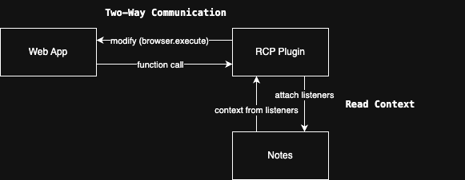
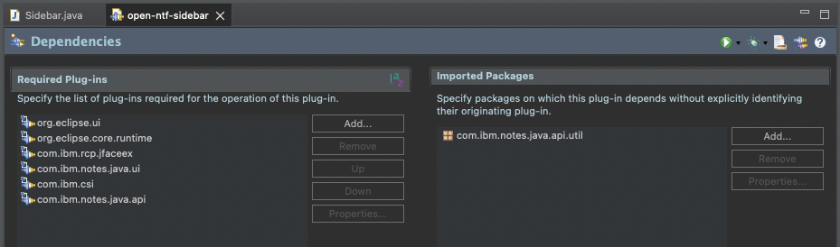

<!-- omit from toc -->
# Extending Notes Client Functionality: Integrating Web Applications with Eclipse Plugins

This guide demonstrates how to create advanced integrations between your Eclipse RCP Plugin and the HCL Notes Client. Learn to access the Notes context and establish two-way communication between your plugin and its embedded web application.



Before diving into these advanced techniques, ensure you've completed the [basic setup instructions](../README.md) to create a functioning Eclipse RCP Plugin with a WebView component.

- [Accessing the Notes Client Context](#accessing-the-notes-client-context)
- [Implementing Listeners for Context Changes](#implementing-listeners-for-context-changes)
- [Inject Data into the Web Application](#inject-data-into-the-web-application)
- [Getting Data from the Web Application](#getting-data-from-the-web-application)

## Accessing the Notes Client Context

The goal is that we always have the latest context of the Notes Client available in our plugin. The best way to achieve this is by using different listeners that will be triggered when the context changes.

This is our starting point:

```java 
package open_ntf_sidebar;

import org.eclipse.swt.SWT;
import org.eclipse.swt.browser.Browser;
import org.eclipse.swt.layout.GridData;
import org.eclipse.swt.layout.GridLayout;
import org.eclipse.swt.widgets.Composite;
import org.eclipse.ui.part.ViewPart;

public class Sidebar extends ViewPart {

	@Override
	public void createPartControl(Composite parent) {
		setPartName("Sample Sidebar Plugin");

		parent.setLayout(new GridLayout(1, true));
		Browser browser = new Browser(parent, SWT.EDGE); // SWT.EDGE uses the Microsoft WebView2 (if installed on the system) it falls back to Internet Explorer

		browser.setLayoutData(new GridData(SWT.FILL, SWT.FILL, true, true));
		browser.setUrl("https://www.google.com");
		browser.setJavascriptEnabled(true);
	}

	@Override
	public void setFocus() {
	}

}
```

The above code snippet creates a new view in the sidebar of the Notes Client. The view contains a `Browser` widget that displays the Google homepage. You can replace the URL with the URL of your web application. 

Now we will proceed to implement the listeners that will allow us to access the Notes Client context.

## Implementing Listeners for Context Changes

First of all we need to add the following dependencies to the `MANIFEST.MF` file of your plugin:



> [!TIP]
> Don´t forget to save the `MANIFEST.MF` file after adding the dependencies.

Unfortunately, I could not manage to resolve or find the following dependencies:

```java
import com.ibm.rcp.swt.events.FocusChangedEvent;
import com.ibm.rcp.swt.events.IFocusChangedListener;
```

These are not included in the Domino UpdateSite and I could not find them anywhere. If you know where to find them, please let me know.

To make eclipse not complain about the missing dependencies (they will be there during runtime), I added empty classes to the `src` folder of the plugin project:

```java
package com.ibm.rcp.swt.events;

import org.eclipse.swt.widgets.Widget;

public class FocusChangedEvent {
    // dummy class for compilation
	public Widget getFocusWidget() {
		return null;
	}
}

```

```java
package com.ibm.rcp.swt.events;

public interface IFocusChangedListener {
	void focusChanged(FocusChangedEvent e);
}
```

With that we can now implement the listeners in our `Sidebar` class:

First we create a `Util.java` class that contains some helper methods:

```java
package open_ntf_sidebar;

import java.util.HashSet;
import java.util.Set;

import org.eclipse.jface.viewers.ISelection;
import org.eclipse.jface.viewers.ISelectionProvider;
import org.eclipse.jface.viewers.StructuredSelection;

import com.ibm.csi.types.DocumentSummary;
import com.ibm.notes.java.ui.NotesUIElement;
import com.ibm.notes.java.ui.NotesUIWorkspace;
import com.ibm.notes.java.ui.adapters.NotesUIViewAdapter;

import lotus.domino.Base;
import lotus.domino.Document;
import lotus.domino.Session;

public class Util {

	@SuppressWarnings("restriction")
	public static ISelectionProvider getGutterViewSelectionProvider() {
		try {
			NotesUIWorkspace notesUIWorkspace = new NotesUIWorkspace();
			NotesUIElement notesUIElement = notesUIWorkspace.getCurrentElement();
			if (notesUIElement instanceof NotesUIViewAdapter)
				return ((NotesUIViewAdapter) notesUIElement).getSelectionProvider();

		} catch (Exception exception) {
		}
		return null;
	}

	public static ISelection getGutterViewSelection() {
		ISelectionProvider iSelectionProvider = getGutterViewSelectionProvider();
		return (iSelectionProvider == null) ? null : iSelectionProvider.getSelection();
	}
	
	public static Set<String> getDocumentUrls(StructuredSelection selection) {
		Set<String> urls = new HashSet<>();

		for (Object selectionO : selection) {

			if (!(selectionO instanceof DocumentSummary)) {
				continue;
			}

			String url = convertUrl(((DocumentSummary) selectionO).getUrl());

			if (url != null) {
				urls.add(url);
			}
		}

		return urls;
	}
	
	private static String convertUrl(String url) {
		if (url == null) {
			return null;
		}

		if (!url.toLowerCase().startsWith("notes:")) {
			return null;
		}

		if (url.indexOf("?") > 0) {
			url = url.substring(0, url.indexOf("?"));
		}

		return url;
	}
	
	public static void recycle(final Base... args) {
		for (Base o : args) {
			if (o != null) {
				try {
					((lotus.domino.Base) o).recycle();
				} catch (Exception e) {
				}
			}
		}
	}
	
	public static Document getDoc(Session session, String url) {
		Document doc = null;

		try {
			// get doc
			Base resolve = session.resolve(url);

			if (resolve instanceof Document) {
				doc = (Document) resolve;
			} else {
				// clean up memory when we don´t have a document
				recycle(resolve);
			}

		} catch (Exception e) {
		}

		return doc;
	}
	
}
```

Next we implement the rest of the logic in the `Sidebar` class:

```java
package open_ntf_sidebar;

import java.util.HashSet;
import java.util.Set;

import org.eclipse.core.runtime.IProgressMonitor;
import org.eclipse.core.runtime.IStatus;
import org.eclipse.core.runtime.Status;
import org.eclipse.jface.viewers.ISelection;
import org.eclipse.jface.viewers.ISelectionChangedListener;
import org.eclipse.jface.viewers.ISelectionProvider;
import org.eclipse.jface.viewers.SelectionChangedEvent;
import org.eclipse.jface.viewers.StructuredSelection;
import org.eclipse.swt.SWT;
import org.eclipse.swt.browser.Browser;
import org.eclipse.swt.layout.GridData;
import org.eclipse.swt.layout.GridLayout;
import org.eclipse.swt.widgets.Composite;
import org.eclipse.swt.widgets.Event;
import org.eclipse.swt.widgets.Listener;
import org.eclipse.ui.ISelectionListener;
import org.eclipse.ui.IWorkbenchPart;
import org.eclipse.ui.IWorkbenchWindow;
import org.eclipse.ui.PlatformUI;
import org.eclipse.ui.part.ViewPart;

import com.ibm.csi.types.DocumentSummary;
import com.ibm.notes.java.api.util.NotesSessionJob;
import com.ibm.rcp.jface.viewers.AsyncStructuredViewer;
import com.ibm.rcp.swt.events.FocusChangedEvent;
import com.ibm.rcp.swt.events.IFocusChangedListener;

import lotus.domino.Document;
import lotus.domino.NotesException;
import lotus.domino.NotesFactory;
import lotus.domino.NotesThread;
import lotus.domino.Session;


public class Sidebar extends ViewPart {
	
	// Document URLs of the last selection occurred
    private Set<String> lastSelection = new HashSet<>();
	private Set<AsyncStructuredViewer> gutterViews = new HashSet<>();
	
	// Different listeners to notice any change in context
	private ISelectionListener docSelectionListener;
	private Listener focusListener;
	private ISelectionChangedListener gutterViewListener1;
	private IFocusChangedListener gutterViewListener2;

	@Override
	public void createPartControl(Composite parent) {
		setPartName("Sample Sidebar Plugin");

		parent.setLayout(new GridLayout(1, true));
		Browser browser = new Browser(parent, SWT.EDGE); // SWT.EDGE uses the Microsoft WebView2 (if installed on the system) it falls back to Internet Explorer

		browser.setLayoutData(new GridData(SWT.FILL, SWT.FILL, true, true));
		browser.setUrl("https://www.google.com");
		browser.setJavascriptEnabled(true);
		
		initListeners();
		IWorkbenchWindow window = PlatformUI.getWorkbench().getActiveWorkbenchWindow();

		window.getSelectionService().addPostSelectionListener(this.docSelectionListener);
		window.getShell().getDisplay().addFilter(4, this.focusListener);
		addActiveGutterViewListener();
	}
	
	private void initListeners() {
		this.docSelectionListener = new ISelectionListener() {
			@Override
			public void selectionChanged(IWorkbenchPart part, ISelection selection) {
				processSelection(part, selection);
			}
		};
		
		this.focusListener = new Listener() {

			@Override
			public void handleEvent(Event event) {
				if (event.widget != null && event.widget.getClass().toString().contains("STable")) {
					addActiveGutterViewListener();
				}
			}
		};
		
		this.gutterViewListener1 = new ISelectionChangedListener() {

			@Override
			public void selectionChanged(SelectionChangedEvent event) {
				try {
					processSelection(null, event.getSelection());
				} catch (Exception e) {
					e.printStackTrace();
				}
			}
		};
		
		this.gutterViewListener2 = new IFocusChangedListener() {

			@Override
			public void focusChanged(FocusChangedEvent event) {
				try {

					if (event.getFocusWidget() != null
							&& event.getFocusWidget().getData() instanceof DocumentSummary) {
						processSelection(null, new StructuredSelection(event.getFocusWidget().getData()));
					} else {
						processSelection(null, Util.getGutterViewSelection());
					}
				} catch (Exception e) {
					e.printStackTrace();
				}

			}
		};
		
	}
	
	private void addActiveGutterViewListener() {
		try {
			ISelectionProvider iSelectionProvider = Util.getGutterViewSelectionProvider();
			if (iSelectionProvider != null && !this.gutterViews.contains(iSelectionProvider)) {

				processSelection(null, Util.getGutterViewSelection());

				if (iSelectionProvider instanceof AsyncStructuredViewer) {

					AsyncStructuredViewer asyncStructuredViewer = (AsyncStructuredViewer) iSelectionProvider;
					this.gutterViews.add(asyncStructuredViewer);
					
					asyncStructuredViewer.addPostSelectionChangedListener(this.gutterViewListener1);
					asyncStructuredViewer.addPostFocusChangedListener(this.gutterViewListener2);
				}
			}
		} catch (Exception e) {
			e.printStackTrace();
		}
	}
	
	private void processSelection(IWorkbenchPart part, ISelection selection) {	
		if (selection == null) {
			return;
		}


		if (part != null && part.getClass().toString().contains("CSIViewPart")) {
			addActiveGutterViewListener();
		}

		if (!(selection instanceof StructuredSelection)) {
			return;
		}

		StructuredSelection structuredSelection = (StructuredSelection) selection;

		Set<String> docUrls = Util.getDocumentUrls(structuredSelection);
		
		// Empty selection
		if (docUrls.isEmpty()) {
			return;
		}
		
		// Selection has not changed since last time
		if (docUrls.equals(lastSelection)) {
			return;
		}

		lastSelection = docUrls;
		
		// Retrieve the actual documents 
		// When using this job you should implement job cancelling on new selections that need to be processed
		new NotesSessionJob("Processing Document Selection") {

			@Override
			protected IStatus runInNotesThread(Session session, IProgressMonitor iProgessMonitor) throws NotesException {
				try {
					processDocuments(docUrls, session);
				} catch (Exception e) {
				}
				return Status.OK_STATUS;
			}
			
		}.schedule(); 
		
		
		// Instead of using the NotesSessionJob you can also do:
		try {
			NotesThread.sinitThread();
			Session session = NotesFactory.createSession();
			processDocuments(docUrls, session);
		} catch (Exception e) {
			e.printStackTrace();
		} finally {
			NotesThread.stermThread();
		}
	}
	
	private void processDocuments(Set<String> docUrls, Session session) throws NotesException {
		for(String docUrl: docUrls) {
			Document doc = Util.getDoc(session, docUrl);

			if (doc == null) {
				continue;
			}
			
			// Do something with the doc (e.g. retrieve its values)
			System.out.println(doc.getItemValueString("Form"));
			
			Util.recycle(doc);
		}

		
	}

	@Override
	public void setFocus() {
	}

}
```
The above code snippet implements the listeners that will allow us to access the Notes Client context. The `docSelectionListener` listens for selection changes in the Notes Client, the `focusListener` listens for focus changes in the Notes Client, and the `gutterViewListener1` and `gutterViewListener2` listen for selection changes in the gutter view.

The `processSelection` method processes the selection and retrieves the documents from the Notes Client. You can either use the `NotesSessionJob` to run the code in a separate thread or use the `NotesThread.sinitThread()` and `NotesThread.stermThread()` methods to run the code in the current thread.

I would recomment using the `NotesSessionJob` to avoid blocking the UI thread and to allow for job cancelling on new selections that need to be processed. However, you still need to implement job cancelling in the `processSelection` method.

A `selection` can either contain a `single` or `multiple documents`. The listeners will fire when:
 - a document is selected in a view
 - multiple documents are selected in a view
 - a document is focused or opened in the Notes Client

Now you have the basic setup to get the current context of the Notes Client and to process the selected documents. You can now use this information to exchange data between your plugin and the web application.

>[!TIP]
> You will probably process the Documents into your own Java Object that you want to pass to the web application. Hefore you will need `GSON` or `Jackson` to convert the Java Object to a JSON string that you can pass to the web application. You could also use `JsonJavaObject` and `JsonJavaArray` from the `lotus.domino` package for that.
>
> The next section will show you how to inject data into the web application.

>[!IMPORTANT]
> Bundling external Libraries with your plugin can cause ClassLoader issues if you have the same libraries already in the Notes Client.
>
> In our case bundling `GSON` resulted in the plugin not loading at all.

## Inject Data into the Web Application

To inject data into the web application, you can use the `Browser` widget's `execute` method to run JavaScript code that interacts with the web application. Be sure that you set the `browser.setJavascriptEnabled(true)` method to `true` in the `createPartControl` method of the `Sidebar` class.

For example, you can pass the selected document data to the web application and update its UI accordingly.

`Example 1`: Call a JavaScript function in the web application to update its UI with the selected document data:

```java
Display.getDefault().asyncExec(() -> {
    String selectedDocumentsJson = convertSelectedDocumentsToJson(selectedDocuments);
    browser.execute("updateUIWithSelectedDocuments(" + selectedDocumentsJson + ");");
});
```

This is probably the best way for a React application to receive the data. You can either call a setState method or a custom function that updates the state of your React component. Same goes for the other modern JavaScript frameworks like Angular, Svelt or Vue.js.

`Example 2`: Directly manipulate the DOM of the web application to display the selected document data:

```java
Display.getDefault().asyncExec(() -> {
    String selectedDocumentsHtml = convertSelectedDocumentsToHtml(selectedDocuments);
    browser.execute("document.getElementById('selected-documents').innerHTML = '" + selectedDocumentsHtml + "';");
});
```

`Example 3`: Modify a variable in the web application to reflect the selected document data:

```java
Display.getDefault().asyncExec(() -> {
    String selectedDocumentsJson = convertSelectedDocumentsToJson(selectedDocuments);
    browser.execute("window.selectedDocuments = " + selectedDocumentsJson + ";");
});
```

>[!IMPORTANT]
> Only call the `execute` method in the `Display.getDefault().asyncExec()` method. Otherwise you will get a `SWTException` because the `Browser` widget is not thread-safe and can only be accessed from the UI thread.

## Getting Data from the Web Application

To enable two-way communication between your web application and the plugin, we'll create a bridge using BrowserFunction. This approach injects a JavaScript function into the web page that can call back into your Java code.

Here's how to implement the `RetrieveWebsiteData.java` class:

```java
package open_ntf_sidebar;

import org.eclipse.swt.browser.Browser;
import org.eclipse.swt.browser.BrowserFunction;

public class RetriveWebsiteData extends BrowserFunction {

	public RetriveWebsiteData(Browser browser, String name) {
		super(browser, name);
	}
	
	@Override
	public Object function(Object[] args) {
		try {			
			String data = (String) args[0];
			
			System.out.println("Received data: %s".formatted(data));
		}catch(Exception e) {
			e.printStackTrace();
		}
		return null;
	}

}
```

Now we can register this function in the `createPartControl` method of the `Sidebar` class:

```java

public class Sidebar extends ViewPart {
	
...

	@Override
	public void createPartControl(Composite parent) {
		...
		Browser browser = new Browser(parent, SWT.EDGE);

		browser.setLayoutData(new GridData(SWT.FILL, SWT.FILL, true, true));
		browser.setUrl("https://www.google.com");
		browser.setJavascriptEnabled(true);

        new RetriveWebsiteData(browser, "callPlugin");
		...
	}

```

When registered with the browser widget, this class creates a JavaScript function (named callPlugin in our example) that becomes available in the web page's global scope. When called from JavaScript, it executes your Java implementation and can return values back to the web application.

```typescript
function sendDataToPlugin(data: string) {
    if (window.callPlugin) {
       const response = window.callPlugin(data);
       // ...
    } else {
        console.error("Plugin function not available");
    }
}
```

This will call the `function` method of the `RetrieveWebsiteData` class and pass the data to it. You can then process the data in the `function` method accordingly. Returning a value from the function is also possible, but is limited to primitive types. For complex data structures, you'll typically return a JSON string that your web application can parse. For more details, see the official [BrowserFunction documentation](https://download.eclipse.org/rt/rap/doc/2.0/guide/reference/api/org/eclipse/swt/browser/BrowserFunction.html).